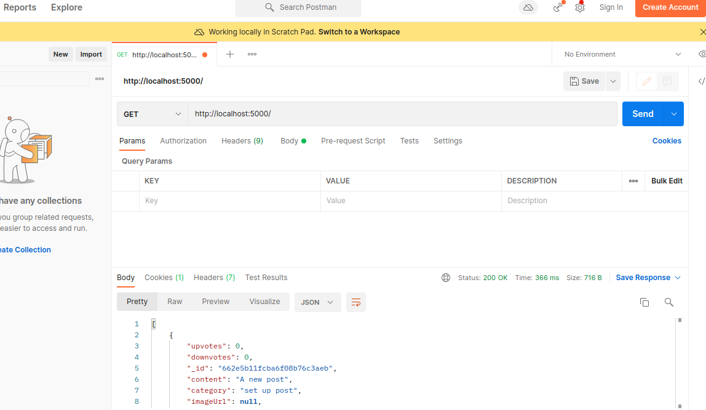

# megaexeprescreeningtest

## API DOCUMENTATION 

### Post Management API

This API allows users to create, view, edit, and delete posts. It also provides functionality for adding comments to posts and replying to comments.

This API allows users to create, view, edit, and delete posts. It also provides functionality for adding comments to posts and replying to comments.

## Dependencies

- [Express](https://www.npmjs.com/package/express): Fast, unopinionated, minimalist web framework for Node.js.
- [Mongoose](https://www.npmjs.com/package/mongoose): MongoDB object modeling tool designed to work in an asynchronous environment.
- [Multer](https://www.npmjs.com/package/multer): Middleware for handling multipart/form-data, primarily used for uploading files.
- [jsonwebtoken](https://www.npmjs.com/package/jsonwebtoken): JSON Web Token implementation for node.js.
- [bcryptjs](https://www.npmjs.com/package/bcryptjs): Library to help you hash passwords.
- [dotenv](https://www.npmjs.com/package/dotenv): Loads environment variables from a .env file into process.env.

## Endpoints

### Get Posts

### Create Posts

Create a new post.

Request Body:
- content (required): The content of the post.
- category (required): The category of the post.
- image (optional): Image file for the post.

Response:
- 201 Created: Returns the created post object.

### Edit a Post
Edit an existing post. Requires authentication and authorization.

Request Body:
- content: Updated content of the post.
- category: Updated category of the post.

Response:
- 200 OK: Returns the updated post object.

### Delete a Post
Delete an existing post. Requires authentication and authorization.

Response:
- 200 OK: Post deleted successfully.

### Retrieve Posts
Retrieve a list of posts. Supports sorting by time posted or by upvotes.

Query Parameters:
- sortBy (optional): Sort posts by 'time' (default) or 'upvotes'.

Response:
- 200 OK: Returns a list of posts.

### Add a Comment
Add a comment to a specific post.

Request Body:
- content (required): The content of the comment.
- userId (required): ID of the user adding the comment.

Response:
- 201 Created: Returns the created comment object.

### Reply to a Comment
Reply to a specific comment on a post.

Request Body:
- content (required): The content of the reply.
- userId (required): ID of the user replying to the comment.

Response:
- 201 Created: Returns the created reply object.

### Retrieve Comments for a Post

Retrieve comments for a specific post, including user information and timestamps.

Response:
- 200 OK: Returns a list of comments.

## Models

### Post

- content: String (required) - The content of the post.
- category: String (required) - The category of the post.
- imageUrl: String - URL of the image associated with the post.
- createdAt: Date - Timestamp when the post was created.
- upvotes: Number - Number of upvotes for the post.
- downvotes: Number - Number of downvotes for the post.
- comments: Array - Array of comment objects.

### Comment

- content: String (required) - The content of the comment.
- user: ObjectID (required) - Reference to the user who posted the comment.
- createdAt: Date - Timestamp when the comment was created.
- replies: Array - Array of reply objects.

### Reply

- content: String (required) - The content of the reply.
- user: ObjectID (required) - Reference to the user who posted the reply.
- createdAt: Date - Timestamp when the reply was created.

## Setup

1. Clone the repository.
2. Install dependencies: `npm install`
3. Start the server: `npm start`

